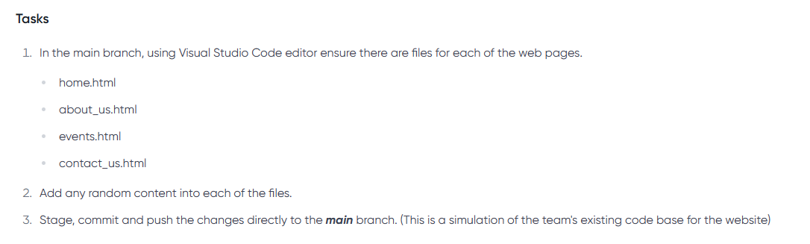
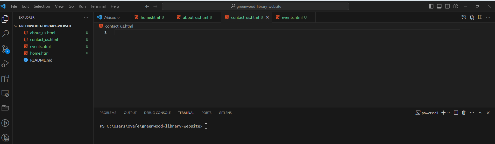
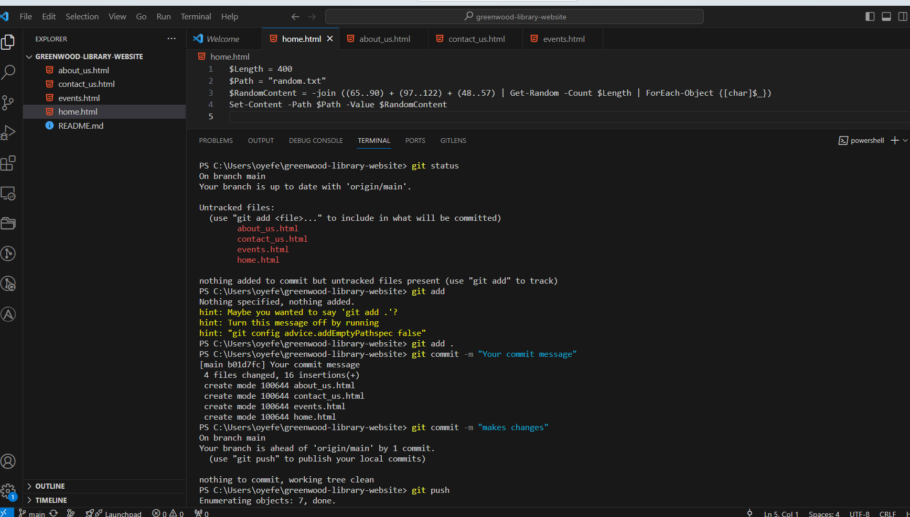
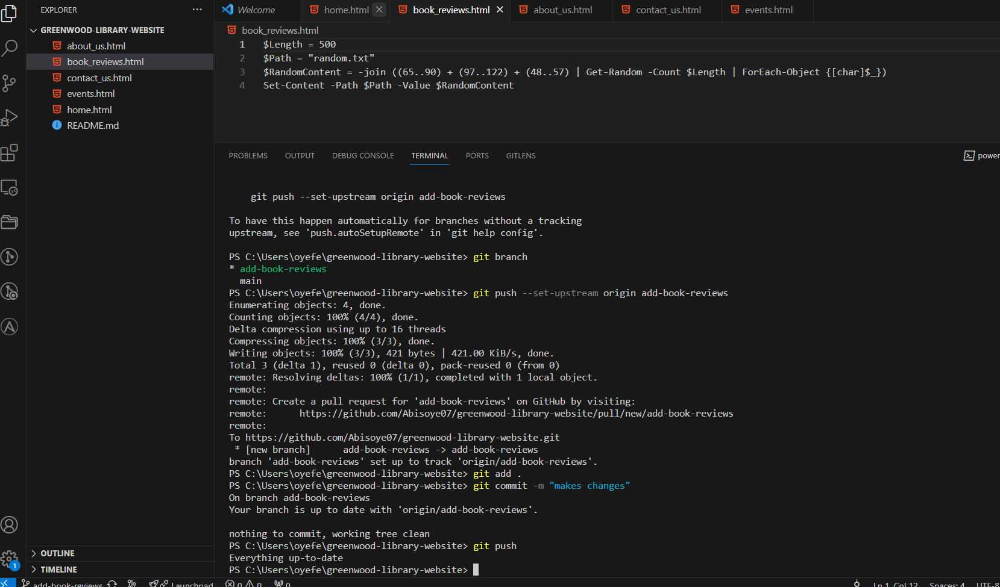
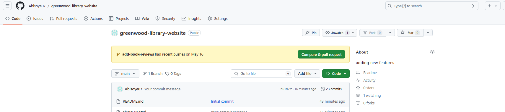
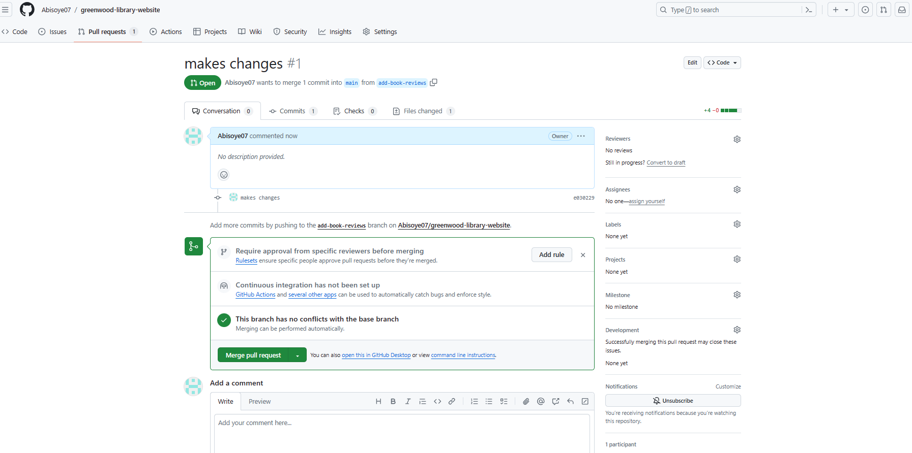
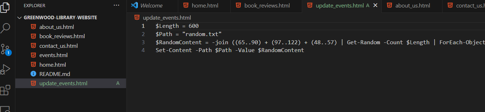
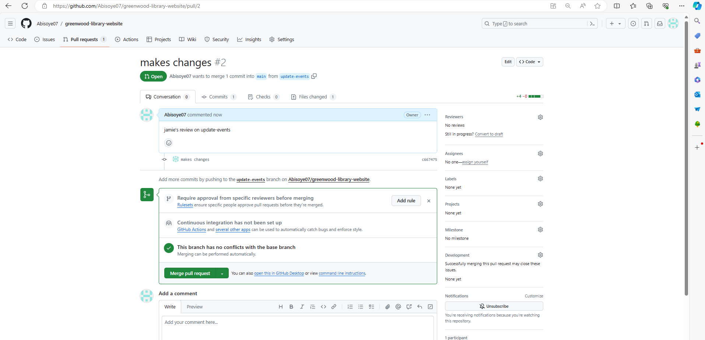
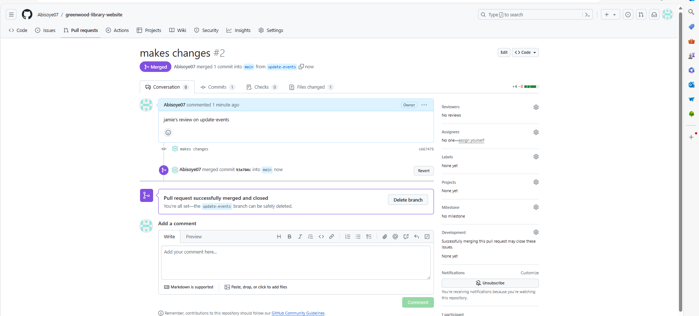

## Greenwood-library-website
create a repository on Github
Name it GREEWOOD-LIBRARY-WEBSITE
Initialize it with a README.md fileand clone it to your local machine

### TASK 2 BELOW

### MORGAN WORK ADDING BOOK REVIEWS

#### JAMIES WORK UPDATING EVENTS PAGE

#### END 
